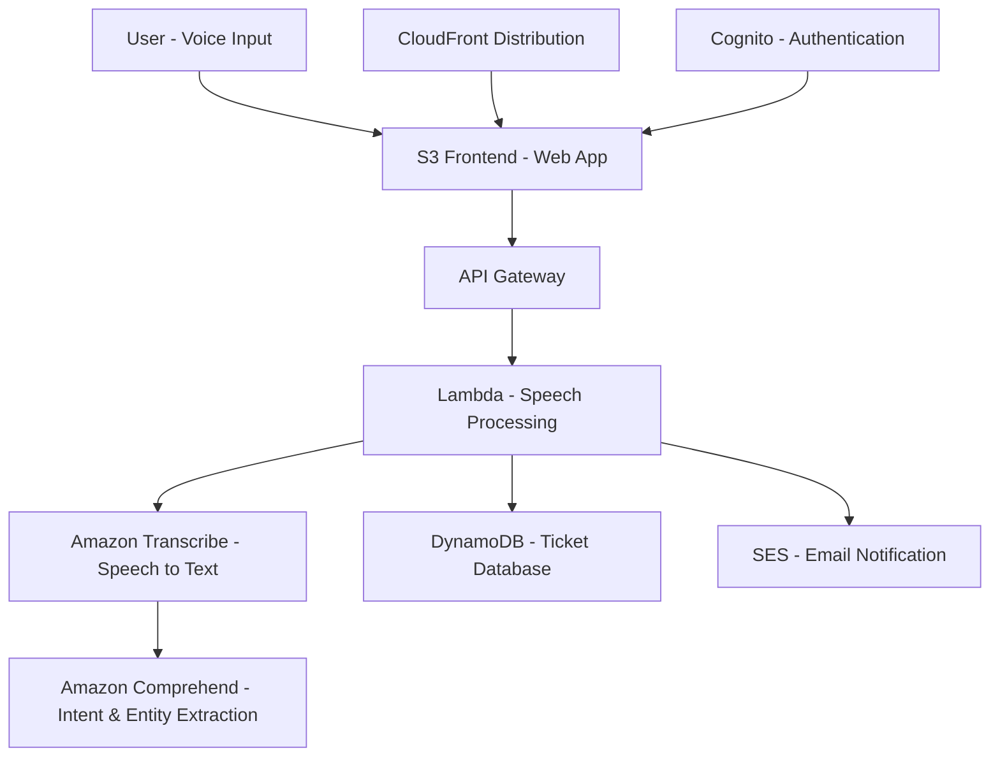

# Voice2Ticket Support System

## Project Overview

The **Voice2Ticket Support System** is an intelligent IT service automation tool that allows users to create and manage support tickets using **voice commands**. By leveraging AWS's AI/ML and serverless services, the solution converts spoken requests into structured tickets, routes them to the appropriate support team, and notifies stakeholders in real time. This system reduces manual effort, shortens resolution times, and enhances the overall user experience in IT support.

---

## Key Features

*  **Voice Input to Ticket**: Convert natural speech into structured support tickets.
*  **AWS Transcribe + Comprehend**: Automatic speech-to-text transcription and intent detection.
*  **Serverless Backend**: AWS Lambda functions process, validate, and store tickets.
*  **DynamoDB Integration**: Secure and scalable storage of tickets and ticket metadata.
*  **Email Notifications (SES)**: Real-time ticket notifications sent to IT support staff.
*  **S3 + CloudFront**: Responsive web interface for submitting and tracking tickets.
*  **Authentication**: AWS Cognito ensures secure user login and access control.

---

## System Architecture



---

## Tech Stack

* **AWS Services**: Transcribe, Comprehend, Lambda, DynamoDB, SES, Cognito, API Gateway, S3, CloudFront, IAM
* **Frontend**: HTML, CSS, JavaScript (voice recording & ticket UI)
* **Backend**: Node.js (Lambda Functions)
* **Infrastructure**: AWS Console (Free Tier)

---

## Project Structure

```
Voice2Ticket-Support-System/
│── frontend/
│   ├── index.html        # Web interface
│   ├── style.css         # Styling for responsive UI
│   └── app.js            # Voice capture and API integration
│
│── backend/
│   ├── ticketLambda.js   # Core ticket creation logic
│   ├── transcribeLambda.js # Speech-to-text processing
│   ├── comprehendLambda.js # NLP intent detection
│   └── api_gateway_config.json
│
└── README.md
```

---

## Deployment Steps

1. **Clone Repo** → `git clone https://github.com/Abhishekbagade/Voice2Ticket-Support-System.git`
2. **Frontend Deployment**:

   * Upload `/frontend` files to an S3 bucket.
   * Enable static hosting and configure CloudFront distribution.
   * Update API Gateway endpoints in `app.js`.
3. **Backend Setup**:

   * Create Lambda functions from `/backend` folder.
   * Integrate with API Gateway.
   * Attach roles & permissions in IAM.
4. **Database**:

   * Create DynamoDB table (`Tickets`) with primary key `TicketID`.
5. **Voice Processing**:

   * Configure Amazon Transcribe for speech-to-text.
   * Integrate Comprehend for intent extraction.
6. **Notifications**:

   * Verify IT support emails in SES.
   * Update SES config in Lambda.
7. **Authentication**:

   * Set up Cognito User Pool.
   * Integrate with frontend for login & secure access.

---

## Outcomes & Impact

* Automated support ticket creation through natural voice commands.
* Reduced ticket logging time by eliminating manual form-filling.
* Improved accuracy of issue categorization via NLP (Amazon Comprehend).
* Enhanced user experience with **real-time notifications and voice-first workflow**.
* Scalable, serverless design that can handle multiple concurrent users.

---

## Future Enhancements

* Add multi-language support with Amazon Translate.
* Integrate Slack/Teams notifications for IT staff.
* Expand intent recognition with custom Comprehend models.
* Provide analytics dashboard with ticket trends and SLA monitoring.

---

## Author

**Author:** Abhishek Bagade  
**Date:** 20th August 2025  

Live Demo: https://voice2ticket-web.s3.us-east-1.amazonaws.com/index.htm


